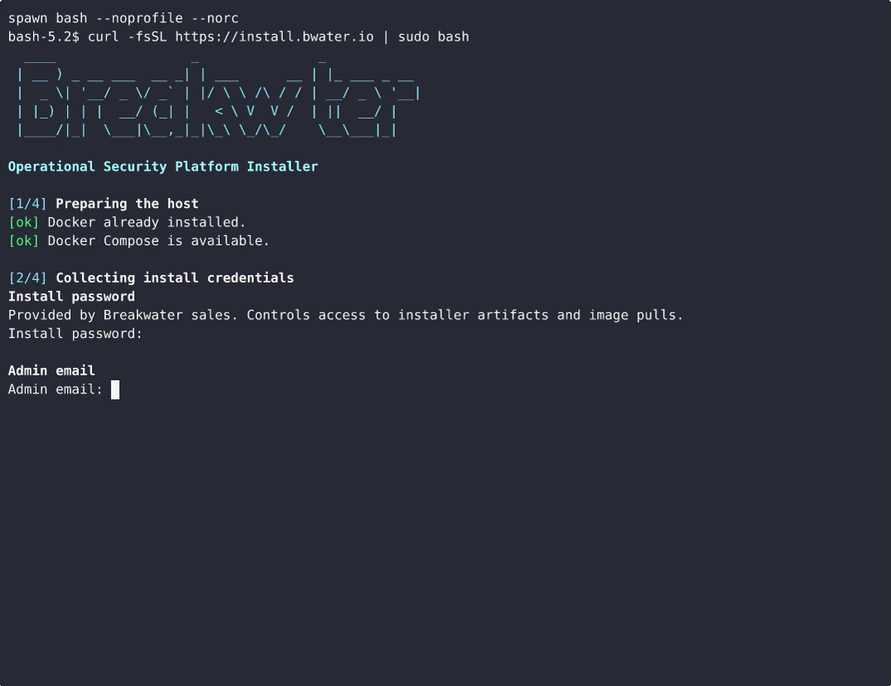
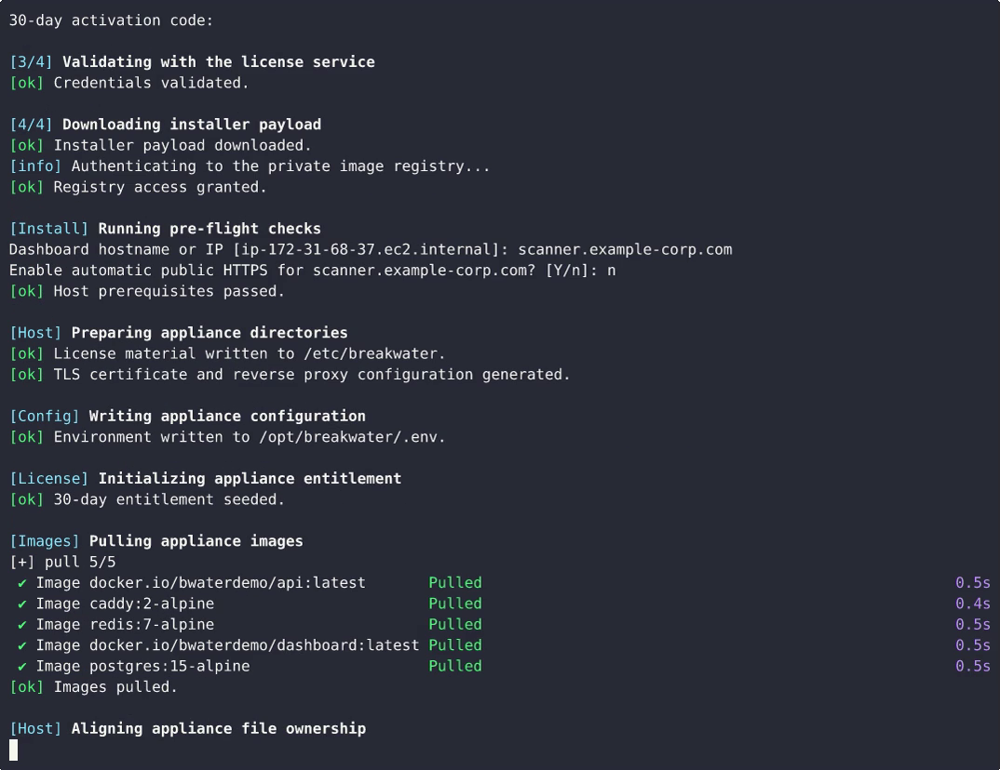
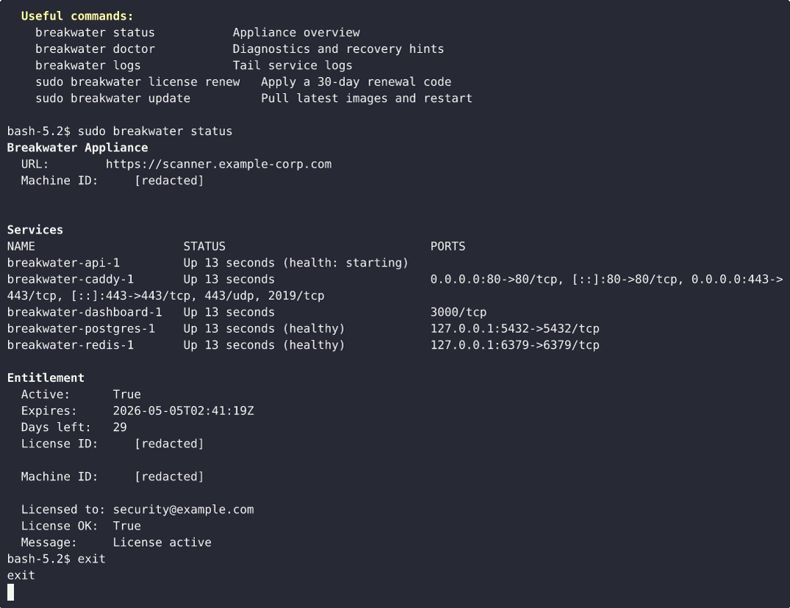

# Breakwater Installation Guide

## Overview

Breakwater ships as a Docker-based appliance. One command installs everything:

```
curl -fsSL https://install.bwater.io | sudo bash
```

The installer prompts for four inputs, pulls private images, starts all services,
creates the admin account, and prints the dashboard URL. Total time: 3-5 minutes
on a typical server.

---

## Prerequisites

| Requirement | Minimum | Recommended |
|-------------|---------|-------------|
| OS | Ubuntu 22.04+ / Debian 12+ / RHEL 9+ | Ubuntu 24.04 LTS |
| CPU | 2 cores | 4+ cores |
| RAM | 4 GB | 8+ GB |
| Disk | 10 GB free | 20+ GB free |
| Network | Internet access for image pulls | Static IP on scan subnet |
| Docker | Installed automatically if missing | Docker CE 27+ |

**Not supported:** macOS, Windows, ARM-only hosts (x86_64 required).

**Why Linux?** Breakwater's scan pipeline uses raw sockets (ARP, mDNS, SSDP, masscan SYN sweeps) which require `CAP_NET_RAW` and host-level L2 network access. Docker Desktop on macOS/Windows cannot provide this.

---

## What You Need Before Starting

You will receive these from Breakwater sales:

1. **Install password** — authenticates you to pull private images
2. **30-day activation code** — a signed license bound to your machine

You will choose during installation:

3. **Admin email** — your login email for the dashboard
4. **Admin password** — minimum 12 characters

The installer will also confirm the dashboard access host. If you provide a DNS
hostname that already resolves to the server, Breakwater can provision a public
certificate automatically. Otherwise it falls back to a locally generated
appliance certificate and prints the fingerprint.

---

## Installation Walkthrough

### Step 1: Run the installer

```bash
curl -fsSL https://install.bwater.io | sudo bash
```

You will see the Breakwater banner:

```
  ____                 _               _
 | __ ) _ __ ___  __ _| | ___      __ | |_ ___ _ __
 |  _ \| '__/ _ \/ _` | |/ \ \ /\ / / | __/ _ \ '__|
 | |_) | | |  __/ (_| |   < \ V  V /  | ||  __/ |
 |____/|_|  \___|\\__,_|_|\_\ \_/\_/    \__\___|_|

 Operational Security Platform — Installer
```

### Step 2: Enter install password

```
Step 1/4: Install password
(Provided by Breakwater sales — protects image access)
Install password: ••••••••••••
```

The installer validates this against `license.bwater.io`. If invalid:

```
[error] Validation failed. Check your install password and activation code.
```

### Step 3: Enter admin email

```
Step 2/4: Admin email
Admin email: admin@yourcompany.com
```

### Step 4: Set admin password

```
Step 3/4: Admin password
Admin password (min 12 chars): ••••••••••••
Confirm: ••••••••••••
```

### Step 5: Enter activation code

```
Step 4/4: 30-day activation code
(Provided with your license — binds to this machine)
Activation code: ••••••••••••
```

### Step 6: Automated setup begins

The installer now runs unattended:

```
[breakwater] Validating credentials...
[breakwater] Credentials validated.
[breakwater] Downloading installer...
[breakwater] Running pre-flight checks...
[breakwater] Pre-flight checks passed.
[breakwater] License key accepted.
[breakwater] Setting up /opt/breakwater...
[breakwater] Writing offline license and public key...
[breakwater] Choosing TLS mode...
[breakwater] Public hostname detected: scanner.yourcompany.com
[breakwater] Automatic HTTPS enabled with Caddy/ACME.
[breakwater] Generating cryptographic secrets...
[breakwater] Writing configuration...
[breakwater] Initializing 30-day trial...
[breakwater] Trial expires: 2026-05-04T00:00:00Z
[breakwater] Pulling Breakwater images (this may take a few minutes)...
  ✓ api:latest pulled
  ✓ dashboard:latest pulled
  ✓ postgres:15-alpine pulled
  ✓ redis:7-alpine pulled
[breakwater] Starting Breakwater...
[breakwater] Waiting for services to become healthy...
  API: waiting... (12s)
[breakwater] API is healthy.
[breakwater] Dashboard is ready.
[breakwater] Creating admin account...
[breakwater] Admin account created.
[breakwater] Installing breakwater CLI...
```

### Step 7: Installation complete

```
============================================================
 Breakwater installed successfully!
============================================================

  Appliance URL:  https://scanner.yourcompany.com/
  API:            http://scanner.yourcompany.com:8000
  Admin:      admin@yourcompany.com
  Password:   <the password you entered>

  Trial expires: 2026-05-04T00:00:00Z (30 days)

  Useful commands:
    breakwater status           Show service status and trial info
    breakwater logs             Tail service logs
    breakwater stop / start     Stop or start services
    breakwater update           Pull latest images and restart
    sudo breakwater license renew   Enter a new extension code
    sudo breakwater uninstall       Remove Breakwater
```

### Step 8: Open the dashboard

Reference terminal screenshots:







The appliance now provisions HTTPS by default. If you installed with a public
DNS hostname that resolves to the appliance, Breakwater requests a public
certificate automatically. Otherwise it generates a local appliance
certificate. Navigate to `https://<your-server>/` in your browser. You'll see
the login page:

```
┌─────────────────────────────────────┐
│                                     │
│        [Breakwater Logo]            │
│                                     │
│   ┌─────────────────────────────┐   │
│   │ Email                       │   │
│   └─────────────────────────────┘   │
│   ┌─────────────────────────────┐   │
│   │ Password                    │   │
│   └─────────────────────────────┘   │
│                                     │
│   ┌─────────────────────────────┐   │
│   │         Sign In             │   │
│   └─────────────────────────────┘   │
│                                     │
└─────────────────────────────────────┘
```

Log in with the admin email and password you set during installation.

### Automated installs

For repeatable provisioning, the bootstrap can run without prompts:

```bash
export BREAKWATER_BOOTSTRAP_INSTALL_PASSWORD='...'
export BREAKWATER_BOOTSTRAP_ADMIN_EMAIL='admin@yourcompany.com'
export BREAKWATER_BOOTSTRAP_ADMIN_PASSWORD='strong-password-here'
export BREAKWATER_BOOTSTRAP_ACTIVATION_CODE='...'
export BREAKWATER_APPLIANCE_HOST='scanner.yourcompany.com'
export BREAKWATER_TLS_MODE='public'
export BREAKWATER_TLS_EMAIL='ops@yourcompany.com'
curl -fsSL https://install.bwater.io | sudo -E bash
```

Supported TLS modes:

- `public`: request a public certificate through Caddy/ACME
- `local`: always generate a local appliance certificate
- `auto`: choose `public` when the hostname resolves to the appliance, otherwise `local`

### Public references

- Public installer repo: `https://github.com/bwater-io/installer`
- Public installation guide: `https://github.com/bwater-io/installer/blob/main/docs/INSTALL_GUIDE.md`
- Public screencast (MP4): `https://raw.githubusercontent.com/bwater-io/installer/main/docs/media/customer-install-demo.mp4`
- Public screencast (GIF): `https://raw.githubusercontent.com/bwater-io/installer/main/docs/media/customer-install-demo.gif`

---

## Post-Installation

### Check status

```bash
breakwater status
```

Output:

```
Breakwater Status

Services:
NAME                STATUS              PORTS
breakwater-api      Up 2 hours (healthy) 0.0.0.0:8000->8000/tcp
breakwater-caddy    Up 2 hours          0.0.0.0:80->80/tcp,0.0.0.0:443->443/tcp
breakwater-dash     Up 2 hours
breakwater-pg       Up 2 hours (healthy) 127.0.0.1:5432->5432/tcp
breakwater-redis    Up 2 hours (healthy) 127.0.0.1:6379->6379/tcp

Trial:
{
  "active": true,
  "expires_at": "2026-05-04T00:00:00Z",
  "days_remaining": 28,
  "extensions_applied": 0
}
```

### View logs

```bash
breakwater logs
```

### Run your first scan

1. Log in to the dashboard
2. Navigate to **Scans** > **New Scan**
3. Enter a subnet (e.g., `192.168.1.0/24`)
4. Click **Start Scan**
5. Watch real-time progress via SSE streaming

---

## License Management

### Check license status

```bash
breakwater license status
```

Or via API:

```bash
curl -s http://localhost:8000/v1/licensing/trial/status | python3 -m json.tool
```

### When the trial expires

After 30 days, the dashboard shows a renewal screen:

```
┌─────────────────────────────────────────┐
│                                         │
│     ⚠  Your trial has expired           │
│                                         │
│  Contact support@bwater.io for a        │
│  renewal code.                          │
│                                         │
│  ┌───────────────────────────────────┐  │
│  │ Enter extension code              │  │
│  └───────────────────────────────────┘  │
│                                         │
│  ┌───────────────────────────────────┐  │
│  │           Activate                │  │
│  └───────────────────────────────────┘  │
│                                         │
│  Machine ID: a1b2c3d4e5f6...            │
│  License ID: BW-2026-0042               │
│                                         │
└─────────────────────────────────────────┘
```

The API returns `403` on all protected endpoints with:

```json
{
  "detail": "Trial expired",
  "message": "Your 30-day trial has expired. Contact support for an extension code.",
  "extend_endpoint": "/v1/licensing/trial/extend"
}
```

### Renew the license

**Option A: CLI**

```bash
sudo breakwater license renew
```

```
Enter your 30-day extension code
(Provided by Breakwater support)
Extension code: ••••••••••••

License extended successfully!
{
  "new_expires_at": "2026-06-03T00:00:00Z",
  "days_remaining": 30
}
```

**Option B: API**

```bash
curl -X POST http://localhost:8000/v1/licensing/trial/extend \
  -H "Content-Type: application/json" \
  -d '{"code": "<extension-code>"}'
```

**Option C: Dashboard** — paste the code into the renewal screen.

### What you need for renewal

Contact `support@bwater.io` with:
- Your **license ID** (shown on the expiry screen)
- Your **machine ID** (shown on the expiry screen, or run `cat /etc/machine-id`)

We will issue a new 30-day code bound to your machine.

---

## Architecture

```
┌────────────────────────────────────────────────────────────┐
│                        Host Machine                        │
│                                                            │
│  ┌──────────────────────┐                                  │
│  │   API (FastAPI)       │ ← network_mode: host            │
│  │   Port 8000           │   CAP_NET_RAW for ARP/mDNS/SSDP│
│  │   22-phase pipeline   │                                  │
│  └──────────┬───────────┘                                  │
│             │ localhost                                     │
│  ┌──────────┴───────────┐  ┌────────────────┐              │
│  │  PostgreSQL 15        │  │  Redis 7        │              │
│  │  Port 5432 (local)    │  │  Port 6379      │              │
│  │  44 DB models         │  │  Scan state     │              │
│  └──────────────────────┘  └────────────────┘              │
│                                                            │
│  ┌──────────────────────┐  ┌─────────────────────────────┐ │
│  │  Dashboard (Next.js)  │  │  Caddy TLS edge             │ │
│  │  Port 3000 (internal) │  │  Ports 80/443               │ │
│  └──────────────────────┘  │  Self-signed appliance cert │ │
│                            └─────────────────────────────┘ │
│                                                            │
│  /etc/breakwater/license.jwt  ← signed license             │
│  /opt/breakwater/.env         ← secrets                    │
│  /opt/breakwater/data/        ← trial state                │
└────────────────────────────────────────────────────────────┘
```

---

## Filesystem Layout

```
/opt/breakwater/
├── docker-compose.customer.yml    # Service definitions
├── .env                           # Generated secrets (chmod 600)
├── Caddyfile                      # HTTPS reverse proxy
├── install.sh                     # Installer (for extend/uninstall)
├── data/
│   └── trial.json                 # Signed trial state
├── tls/
│   ├── server.crt                 # Appliance certificate
│   └── server.key                 # Appliance private key
└── breakwater                     # CLI tool (also at /usr/local/bin/)

/etc/breakwater/
└── license.jwt                    # RSA-signed license file
```

---

## Updating

```bash
sudo breakwater update
```

This pulls the latest images and restarts services with zero-downtime.

---

## Uninstalling

```bash
sudo breakwater uninstall
```

This stops all services, removes Docker volumes (including scan data), and
deletes `/opt/breakwater`. This action is **irreversible**.

---

## Troubleshooting

### API won't start

```bash
breakwater logs | grep -i error
```

Common causes:
- **Trial expired** — run `sudo breakwater license renew`
- **Port 8000 in use** — `sudo lsof -ti:8000`
- **PostgreSQL not ready** — `breakwater restart`

### Dashboard shows blank page

The dashboard proxies API calls. If the API is down:
```bash
curl http://localhost:8000/health
breakwater restart
```

### Scan finds no devices

- Ensure the server is on the same L2 subnet as target devices
- Check: `ip addr show` — the scan interface must have an IP on the target range
- For remote subnets, deploy a [Breakwater Agent](../agents/)

### Permission denied on network operations

The API container needs `CAP_NET_RAW`. Verify:
```bash
docker inspect breakwater-api | grep -A5 CapAdd
```

---

## Support

Support is available for licensed installations only. When contacting support, include:

```bash
breakwater status > support-bundle.txt 2>&1
cat /etc/machine-id >> support-bundle.txt
```

Email: support@bwater.io
